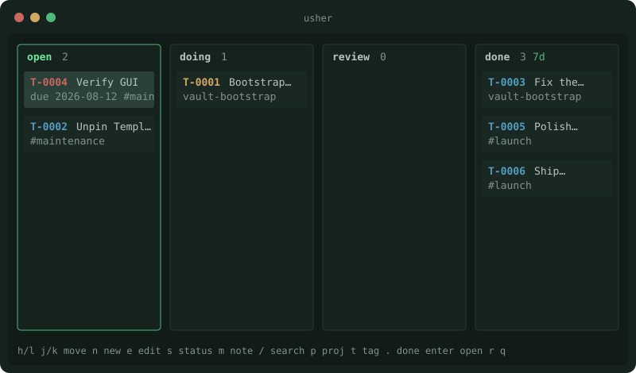
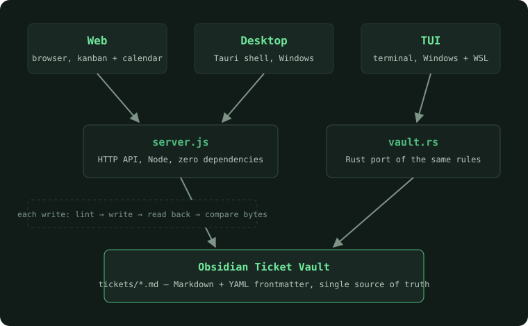

<p align="center">
  
</p>

<p align="center">
  <b>usher</b> is a set of task-app front ends for an Obsidian "Ticket Vault".<br>
  The Markdown files stay the single source of truth. usher only reads and edits them.<br>
  The name comes from the usher who tears your ticket.
</p>

---

> **Important:** usher does not operate on a general Obsidian vault.
> The vault must follow the Ticket Vault structure from
> [y4m3/obsidian-template](https://github.com/y4m3/obsidian-template)
> (by the same author). See [The vault format](#the-vault-format).

## Front ends

Three front ends share one vault:

| Front end | Where | Start |
| --------- | ----- | ----- |
| **Web** | browser | `node server.js` → http://localhost:3000 |
| **Desktop** | Windows | `cd desktop && cargo run` (a Tauri shell around the web UI) |
| **TUI** | Windows, WSL, Linux | `usher` (see [Install the usher command](#install-the-usher-command)) |

<p align="center">
  
</p>

## Architecture

<p align="center">
  
</p>

The web and desktop front ends speak to `server.js`.
The TUI has its own Rust port of the same rules (`tui/src/vault.rs`), because WSL has no Node by design.
The two write engines obey the same test scenario: a write may only touch the lines it must change.

## Quick start

### Web

```
node server.js [vault-root]   # default vault-root: ../obsidian
```

Set `PORT` to change the default port 3000.
`PORT=0` gives an OS-assigned free port.
The server has zero dependencies. Node is sufficient.

### Install the usher command

The TUI builds natively on Windows and on Linux/WSL.

```powershell
cargo install --path tui                 # puts usher.exe on PATH (~\.cargo\bin)
setx USHER_VAULT C:\path\to\your\vault   # default vault, applies to new shells
usher                                    # start from anywhere
```

All three front ends resolve the vault in the same order: CLI argument, then `USHER_VAULT`,
then a per-front-end default (`../obsidian` for web/desktop, the current directory for the TUI).
See [`tui/README.md`](tui/README.md) for the TUI's keys and WSL build.

## The vault format

The vault structure comes from [y4m3/obsidian-template](https://github.com/y4m3/obsidian-template).
Start from that template, or make the minimum tree below.
usher reads and writes a vault with this layout:

```
vault-root/
├── tickets/                        # one Markdown file for each ticket
│   └── T-0042-fix-the-thing.md    #   T-NNNN[-slug].md
└── system/
    ├── scripts/check_vault.js      # the vault's own lint (the web server requires it;
    │                               #   the TUI has a Rust port)
    └── templates/ticket.md         # the Templater template that new tickets copy
```

A ticket file has this exact shape.
The shape is important: usher edits the file line by line, and its lint rejects other shapes.

```markdown
---
id: T-0042
title: "Fix the thing"
status: open
priority: normal
project: 
repos: []
tags: []
created: 2026-08-09
due: 
closed: 
branch: T-0042-fix-the-thing
---

## Summary

Fix the thing

## Notes

- 

## Log

- 2026-08-09 12:00 — created
```

Rules:

- **Frontmatter fields**, always present, in this order: `id`, `title`, `status`, `priority`, `project`, `repos`, `tags`, `created`, `due`, `closed`, `branch`. The lint rejects a ticket that is missing one, empty value or not: usher edits a field line in place and cannot add one, so a file without the line would pass the lint and then fail the first write that touches it.
- An empty scalar value keeps one space after the colon (`due: `). usher keeps that byte.
- **`status`** is one of: `open`, `doing`, `review`, `done`, `archived`. The board shows the first four.
- **`closed`** dates the day the work finished. A move to `done` sets it. A move to anything but `done` or `archived` clears it, so the date never outlives the work it describes; `archived` is the exception, so a finished ticket keeps its date when it is filed away. The lint enforces both directions: `done` without a date, and a date without `done` or `archived`.
- **`priority`** is one of: `urgent`, `high`, `normal`, `low`.
- **Body sections**, in this order: `## Summary`, `## Notes`, `## Log`.
- usher edits Summary and Notes. Log is append-only, one line for each entry: `- YYYY-MM-DD HH:mm — message`.
- The web server loads `system/scripts/check_vault.js` from the vault and does not start without it. Each write must pass this lint.
- New tickets are byte-identical to the output of `system/templates/ticket.md`.

To start a new vault, make the tree above: an empty `tickets/` folder plus the two `system/` files from the template vault.

## Write safety

usher does not normalize the vault format:

- No YAML parser. Only line-based edits. Lines that usher does not edit stay byte-identical, CRLF or LF included.
- Each write goes through the lint first. A write that fails the lint does not touch the disk.
- After a write, usher reads the file back and compares the bytes. On a mismatch, usher restores the original content.
- A write that changes nothing is skipped.

## Layout

- `server.js` — the Node server and all vault write logic for the web/desktop front ends.
- `public/index.html` — the full web UI (vanilla HTML/JS, Tracer theme).
- `desktop/` — a Tauri v2 shell around the web UI.
- `tui/` — the Rust/ratatui terminal client, with its own port of the write logic.
- `test.js` — the web test suite. It copies the vault and starts its own server.
- `assets/` — the logo and the diagrams in this file.

## Tests

Both suites read `tests/fixtures/vault`, a fixture checked into the repo, so no
external vault setup is needed.

```
node test.js           # web: throwaway vault copy + OS-assigned port
cd tui && cargo test   # TUI: Windows native or WSL
```

## Known limits

- No authentication, no HTTPS. The server binds to `127.0.0.1` only.
- `archived` tickets do not show on the board. The API still returns them.
- No file watch. The UI refreshes on focus and each 30 seconds.
- A release build of the desktop shell has no console, so a startup failure (the port already taken, `server.js` exiting early) prints where nobody sees it. Start it from a terminal to read the reason.

## License

[MIT](LICENSE) — the same license as
[y4m3/obsidian-template](https://github.com/y4m3/obsidian-template).
